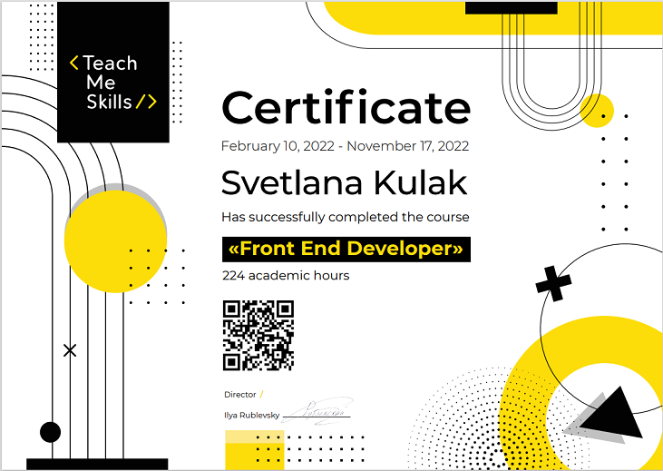

# Kulak Svetlana

## Junior Frontend Developer

---

### Contacts:

Phone: +375(33) 357-54-14

Email: kylak.sveta2017@gmail.com

Telegram: @lana_022

[Linkedin](https://www.linkedin.com/in/svetlana-kulak-492a73248/)

---

### About Myself:

All my life I have a desire to continuously learn something new. After graduating from university and having worked in financial fields for several years, I decided that I was hungry for new knowledge in another industry. My choice fell on web development.

While studying this IT direction, I encountered many difficulties in understanding some topics, but at the same time I found something in this business that inspires me and brings me pleasure.

There is something wonderful about when you look for a bug in your code and try to make it workable and finally find a solution to the problem. I love to see the result of my work in the form of a beautiful and useful site for users. I like to see how the designer's layout turns into a real website in the vastness of the browser.

Now I am at the relative beginning of my path of becoming a developer and I think that I will succeed and I will fully know the advantages and opportunities of this profession.

---

### Skills and Proficiency:

- HTML5, CSS3;

- Less, Sass;

- Bootstrap;

- Adaptive layout;

- JavaScript, TypeScript;

- Git, GitHub;

- React, Redux;

- Webpack, Parcel;

- Figma, Photoshop;

---

### Code example:

Write a function getSum(n) that calculates the sums of the numbers 1 + 2 + ... + n.

```
function getSum(n) {
  if (n == 1) return 1;
  return n + sumTo(n - 1);
}
```

---

### Courses:

- Course «Front End Developer» from [TeachMeSkills](https://teachmeskills.by) school.



- JavaScript Manual on learnjavascript.ru (in progress)

* RS Schools Course «JavaScript/Front-end. Stage 0» (in progress)

---

### Languages:

- Russian - Native
- Belarussian - Basic
- Inglish - Intermidiate

